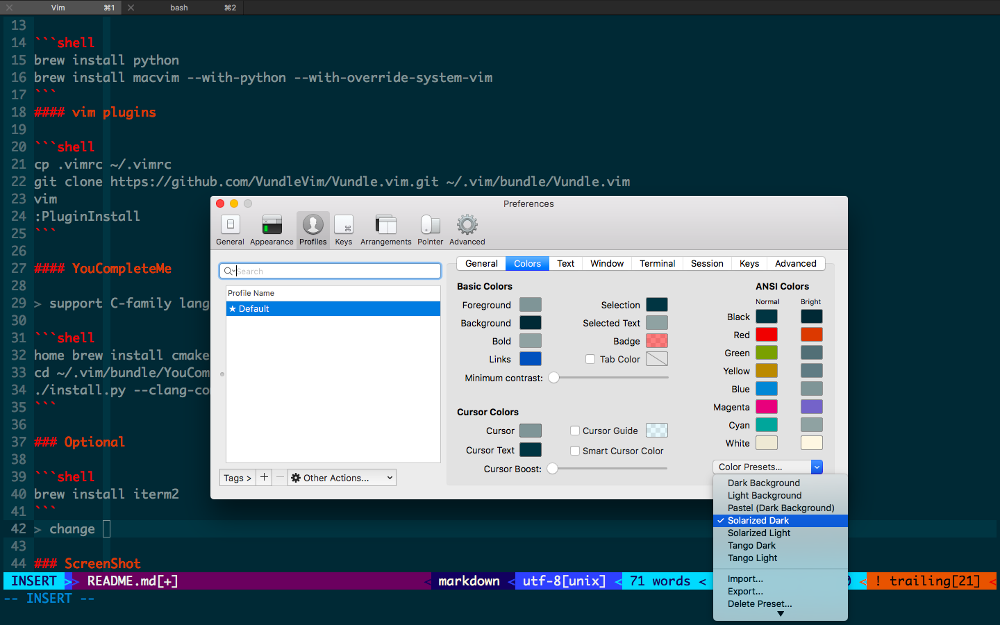
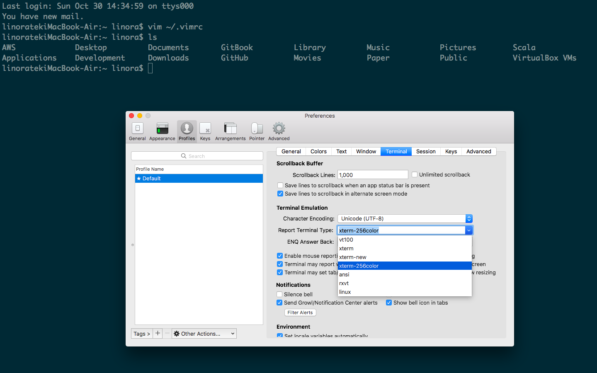

# vim4ide

use vim as ide

> maybe you like [vimAwesome](http://vimawesome.com).


### How to setup


#### macvim

```shell
brew install python
brew install macvim --with-python --with-override-system-vim
```
#### vim plugins

```shell
cp .vimrc ~/.vimrc 
git clone https://github.com/VundleVim/Vundle.vim.git ~/.vim/bundle/Vundle.vim
vim
:PluginInstall
```

#### YouCompleteMe

> support C-family language,GO,Typescript,Javascript

```shell
home brew install cmake
cd ~/.vim/bundle/YouCompleteMe
./install.py --clang-completer  --gocode-completer --tern-completer
```

### Optional

```shell
brew install iterm2
```
> config settings as below




### ScreenShot


